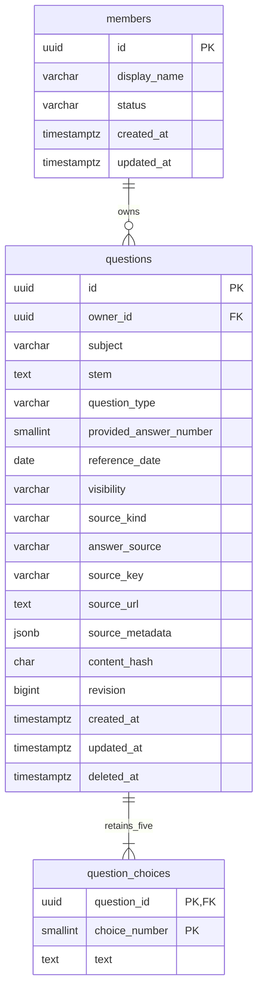

# 2주차 문제 저장·조회

구현 범위는 V002의 회원·문제·선택지와 POST/GET 단건 API다. 로그인·목록·수정·삭제·분석 접수는 후속 주차에 구현한다. 기존 V001은 변경하지 않았으며 V001 → V002로 적용한다.

선택지는 번호1~5를 복합 PK로 정규화한다. 등록은 부모와 자식5개를 하나의 트랜잭션에 저장한다. deferred constraint trigger가 커밋 시 부모당5개를 검사하며, 자식 변경 전에 부모를 잠가 동시 변경을 직렬화한다. 양쪽 부모에 영향을 주는 이동도 검사한다. soft delete 후에도 원본 선지5개를 보존한다.

활성 질문의 `(owner_id,content_hash)` 및 활성 source_key는 부분 UNIQUE다. 같은 소유자의 정규화된 중복 등록은409이며 타인의 동일 내용은 허용한다. 삭제된 내용은 다시 등록 가능하다. FK·범위·길이·출처/공개 정책을 DB에서도 검사한다. PUBLIC은 검수된 EXAM_IMPORT/OFFICIAL_VERIFIED만 가능하며 사용자 등록 API는 항상 PRIVATE다.

contentHash는 정규화된 subject/stem/questionType/번호순 choices/providedAnswerNumber/referenceDate를 고정 필드 순서·UTF-8·공백 없는 JSON으로 직렬화한 SHA256이다. 지문·선지의 CRLF/CR만 LF로 바꾸고 앞뒤 공백을 제거하며 내부 공백/부정 표현은 보존한다. 길이는 Unicode code point 기준이다.

## 흐름

`엄격 JSON/128KiB 검사 → @Valid DTO → MemberResolver → QuestionService → JPA Repository → PostgreSQL 커밋 → DTO + Location/ETag`

단건은 삭제되지 않은 본인/공개 문제만 읽는다. 익명은 공개 단건만 가능하고 타인의 비공개/삭제/없는 문제는 같은404다. 비활성 회원은403. 엔티티·ownerId·인증 정보는 응답하지 않는다.

## 인증 준비

MemberResolver는 서버 SecurityContext의 UUID principal과 ACTIVE 회원을 확인한다. 클라이언트 memberId 헤더를 인증으로 사용하지 않는다. 개발용 회원은 `LAWGROUND_DEV_AUTH_ENABLED=true`를 명시하고 local·loopback에서만 사용한다. prod/test 또는 외부 주소에서 켜면 기동이 실패한다. 개발 CSRF 경로는 `/api/v1/dev/csrf`, local 전용이며 CSRF를 끄지 않는다. 실제 Google 로그인·세션은5주차다.

## 후속 저장 구조

이번 DB에는 회원/문제/선택지3개만 생성한다. 법령·버전·조문·청크(V003), 실행·작업·근거(V004), pgvector1024/FTS 색인(V005), OAuth/JDBC 세션(V006), 골든셋·평가(V007), 선지별 관계·복수 인용(V008), 기출 배치(V009)는 관련 기능 주차에 추가한다. 분석 입력 스냅샷은 현재 선택지 행을 그대로 참조해 과거 결과가 바뀌게 만들지 않는다. outbox는 제외한다.

## 검증

`gradlew clean check bootJar`는 기존 기반 회귀와 실제 PostgreSQL의 migration/제약/등록·조회·권한·중복 경합·trigger 직렬화·dump/restore를 검사한다. 로컬 동작 재현은 [실행 안내](../runbooks/local-development.md)를 따른다. 초기테스트·최종테스트 결과와 구현 상태를 구분하며 원격 CI 결과는 push 후 확인한다.
